# 作业：第1章

> 2022年8月25日。

## 1 名词解释

<dl>
    <dt>分时</dt>
    <dd>多个使用者在不同时间使用相同设备。具体到用户使用CPU，是将CPU的单位时间划分为若干时间片，每个用户轮流在他的时间片使用CPU。</dd>
    <dt>并发</dt>
    <dd>多个程序在同一时间段内执行（从启动到完成），但每一时刻不一定同时执行。</dd>
    <dt>周转时间</dt>
    <dd>一个作业从进入系统到退出所经历的时间。</dd>
    <dt>系统调用</dt>
    <dd>操作系统提供的向内核请求服务或资源的程序。</dd>
</dl>

## 2 多道程序设计技术

- **什么是**

  在主存中同时存放多个作业同时运行的程序设计方法。

- **引入原因**

  单道时，CPU 一次只能加载一个程序，一旦程序请求慢速设备，CPU就只能等待，无法执行别的程序。因此单道时 CPU 利用率较低，希望提高。

  另外单道时 CPU 不会同时操作多个设备（设备之间可并行），且一操作设备就只能等待（CPU 和设备可并行），不能执行别的程序（程序之间有时可并行），系统设备的并行性未被充分利用。

- **特点**

  - 资源利用率高。
  - 吞吐量高。
  - 用户无法与作业交互。
  - 作业平均周转时间较长。
  - 适合处理计算量大的成熟作业。

## 3 并发执行

> 在一个计算机系统中，有一台输入设备和一台打印机。现有两道程序投入运行，并且程序A先于程序B开始运行。程序A的运行轨迹为：计算50ms，打印100ms，计算50ms，打印100ms；程序B的运行轨迹为：计算50ms，输入80ms，计算100ms。

```mermaid
gantt
    dateFormat SSS
    axisFormat %L ms
    
    section 输入
    B: crit, 100, 180
    
    
    section 计算
    A: 000, 050
    B: crit, 050, 100
    A: 150, 200
    B: crit, 200, 300

    
    section 打印
    A: 050, 150
    A: 200, 300
```

### (1) 两道程序运行时，CPU有无空闲等待？若有，请给出其等待时间段，并说明原因。

有，100–150 ms。

50–150 ms A在等待打印，100–180 ms B在等待输入，都用不到 CPU。

### (2) 程序A和B有无等待CPU的情况？若有，请给出等待时间段，并说明原因。

A没有；B有，180–200 ms。150–200 ms A正在计算第二段，不可剥夺；180 ms 时B完成输入，开始等待。

另外开头的 0–50 ms B也在等待 CPU，此时 A 计算第一段。

### (3) 若采用不可剥夺调度策略，不考虑调度和切换时间，则完成两个作业需要的时间最少是多少。请说明原因。

300 ms。

- 一方面，A 的总时长为 50 ms + 100 ms + 50 ms + 100 ms = 300 ms，完成两个作业需要的时间必然大于等于完成 A 需要的时间。
- 另一方面，上图已经给出了 300 ms 的方案。

## 4 核心态和用户态

- **什么是**

  - 内核态是允许执行全部指令、访问所有寄存器和缓冲区的操作模式。
  - 用户态是只允许执行非特权指令、访问指定的一部分寄存器和缓冲区的操作模式。

- **为什么**

  防止用户程序破坏操作系统或直接操作硬件，严格区分操作系统代码和用户代码。方便安全使用。

## 5 分层结构操作系统

从内向外：

1. 裸机
1. CPU调度和P/V操作
1. 内存管理
1. 设备管理
1. 文件管理
1. 命令管理
1. 用户

原因：

1. 用户不是操作系统的一部分……放在最外层。

2. 最内层是物理硬件（裸机），最外层是给使用者的接口（命令管理）。

   （至此：裸机 → … → 命令管理 → 用户）

3. CPU、内存是计算机核心部件，硬盘等设备是外围部件，所以“CPU调度和P/V操作”“内存管理”在内，“文件管理”“设备管理”在外。

   （至此：裸机 → CPU/内存 → 文件/设备 → 命令管理 → 用户）

4. 比较“文件管理”与“设备管理”。设备可以抽象成文件，所以更抽象的文件在外，更具体的设备在内。

5. 比较“CPU调度和P/V操作”与“内存管理”。多道操作系统以主存为中心，数据按“硬盘 → 内存 → CPU”流动，所以“CPU调度和P/V操作”更靠内，“内存管理”更靠外。