# 作业：第2章

> 2022年9月7日，2022年10月21日。

## 1 进程状态转换

> 假定有一个进程A，其工作流程如图1所示。如果系统中进程只有三种状态（就绪、运行、阻塞），并且进程被调度程序选中后就可以投入运行，且时间片为 200 ms，请顺序列出该进程从开始到结束所经历的状态转换过程，并说明原因。

```mermaid
gantt
    dateFormat SSS
    axisFormat %L ms
    
    就绪: milestone, 000, 0
    运行: 000, 200
    就绪: milestone, 200, 0
    运行: 200, 250
    阻塞（盘I/O请求）: crit, milestone, 250, 0
    就绪: milestone, 250, 0
    运行: 250, 300
    阻塞（带I/O请求）: crit, milestone, 300, 0
    就绪: milestone, 300, 0
    运行: 300, 480
    阻塞（打印请求）: crit, milestone, 480, 0
    就绪: milestone, 480, 0
    运行: 480, 630
```

> 横坐标表示进程的已运行时间，不表示实际时间。

1. 就绪：创建进程后即就绪。
2. 就绪→运行：等到 CPU 空闲时开始计算。
3. 运行→就绪→运行：达到时间片 200 ms 时被剥夺。之后 CPU 空闲时继续计算。
4. 运行→阻塞→就绪：第一段（200 ms + 50 ms）计算结束，发起“盘I/O请求”，阻塞。请求完成后就绪。
5. 就绪→运行：CPU 空闲时开始第二段计算（50 ms）。
6. 运行→阻塞→就绪：未用完时间片第二段就计算结束，发起“带I/O请求”，阻塞。请求完成后就绪。
7. 就绪→运行：CPU 空闲时开始第三段计算（180 ms）。
8. 运行→阻塞→就绪：未用完时间片第三段就计算结束，发起“打印请求”，阻塞。请求完成后就绪。
9. 就绪→运行：CPU 空闲时开始第四段计算（150 ms）。
10. 运行→（结束）：未用完时间片第四段就计算结束，结束进程。

## 2 最小平均周转时间

> 有5个同时到达的进程正在等待运行，它们的估计运行时间分别为9、6、3、5和x。为了获得最小的平均周转时间，应按照什么顺序执行这5个进程？要求给出进程的执行顺序和相应的最小平均周转时间（该时间应为x的函数）。

最优解是按最短剩余时间优先。这里同时到达，所以执行顺序就是“按估计运行时间从短到长依次运行”。

- $x \in (0,3)$

  顺序：$x,3,5,6,9$。

  时间：$\frac15 \qty(5\times x + 4\times 3 + 3\times 5 + 2\times6 + 1\times 9) = 9.6 + x$。

- $x \in [3,5)$

  顺序：$3,x,5,6,9$。

  时间：$\frac15 \qty(5\times 3 + 4\times x + 3\times 5 + 2\times6 + 1\times 9) = 10.2 + 0.8x$。
  
- $x \in [5,6)$

  顺序：$3,5,x,6,9$。

  时间：$\frac15 \qty(5\times 3 + 4\times 5 + 3\times x + 2\times6 + 1\times 9) = 11.2 + 0.6x$。
  
- $x \in [6,9)$

  顺序：$3,5,6,x,9$。

  时间：$\frac15 \qty(5\times 3 + 4\times 5 + 3\times 6 + 2\times x + 1\times 9) = 12.4 + 0.4x$。
  
- $x \in [9,+\infty)$

  顺序：$3,5,6,9,x$。

  时间：$\frac15 \qty(5\times 3 + 4\times 5 + 3\times 6 + 2\times 9 + 1\times x) = 14.2 + 0.2x$。

因此最小平均周转时间为
$$
\begin{cases}
9.6 + x & x \in (0,3). \\
10.2 + 0.8x & x \in [3,5). \\
11.2 + 0.6x & x \in [5,6). \\
12.4 + 0.4x & x \in [6,9). \\
14.2 + 0.2x & x \in [9+\infty). \\
\end{cases}
$$

## 3 各种调度算法

> 考虑如下表所示的一组进程，进程占用的CPU区间长度以毫秒来计算：
>
> | 进程 | 区间时间 | 优先级 |
> | :--: | :------: | :----: |
> |  P1  |    10    |   3    |
> |  P2  |    1     |   1    |
> |  P3  |    2     |   3    |
> |  P4  |    1     |   4    |
> |  P5  |    5     |   2    |
>
> 假设在0时刻进程以P1、P2、P3、P4、P5的顺序到达。
>
> 画出4个Gantt图分别演示使用FCFS、SJF、非抢占优先级（数字越小表示优先级越高）和RR（时间片为1）算法调度时进程的执行过程，并给出每种调度算法下每个进程的周转时间、等待时间。对所有进程，哪一种调度算法的平均等待时间最小？

### FCFS

```mermaid
gantt
dateFormat SSS
axisFormat %L ms

P1: 000, 010
P2: 010, 011
P3: 011, 013
P4: 013, 014
P5: 014, 019
```

| 进程 | 区间时间 | 等待时间 | 周转时间 |
| :--: | :------: | :------: | :------: |
|  P1  |    10    |    0     |    10    |
|  P2  |    1     |    10    |    11    |
|  P3  |    2     |    11    |    13    |
|  P4  |    1     |    13    |    14    |
|  P5  |    5     |    14    |    19    |

平均等待时间：9.6 ms。

### SJF

```mermaid
gantt
dateFormat SSS
axisFormat %L ms

P2: 000, 001
P4: 001, 002
P3: 002, 004
P5: 004, 009
P1: 009, 019
```

| 进程 | 区间时间 | 等待时间 | 周转时间 |
| :--: | :------: | :------: | :------: |
|  P1  |    10    |    9     |    19    |
|  P2  |    1     |    0     |    1     |
|  P3  |    2     |    2     |    4     |
|  P4  |    1     |    1     |    2     |
|  P5  |    5     |    4     |    9     |

平均等待时间：3.2 ms。

### 非抢占优先级（数字越小表示优先级越高）

```mermaid
gantt
dateFormat SSS
axisFormat %L ms

P2: 000, 001
P5: 001, 006
P1: 006, 016
P3: 016, 018
P4: 018, 019
```

| 进程 | 区间时间 | 优先级 | 等待时间 | 周转时间 |
| :--: | :------: | :----: | :------: | :------: |
| P1 |    10    |    3    | 6 | 16 |
| P2 |    1     |    1    | 0 | 1 |
| P3 |    2     |    3    | 16 | 18 |
| P4 |    1     |    4    | 18 | 19 |
| P5 |    5     |    2    | 1 | 6 |

平均等待时间：8.2 ms。

### RR（时间片为1）

```mermaid
gantt
dateFormat SSS
axisFormat %L ms

section P1
P1: 000, 001
P1: 005, 006
P1: 008, 009
P1: 010, 011
P1: 012, 013
P1: 014, 015
P1: 015, 016
P1: 016, 017
P1: 017, 018
P1: 018, 019
完成: milestone, 019, 0

section P2
P2: 001, 002
完成: milestone, 002, 0

section P3
P3: 002, 003
P3: 006, 007
完成: milestone, 007, 0

section P4
P4: 003, 004
完成: milestone, 004, 0

section P5
P5: 004, 005
P5: 007, 008
P5: 009, 010
P5: 011, 012
P5: 013, 014
完成: milestone, 014, 0
```

| 进程 | 区间时间 | 等待时间 | 周转时间 |
| :--: | :------: | :------: | :------: |
|  P1  |    10    |    9     |    19    |
|  P2  |    1     |    1     |    2     |
|  P3  |    2     |    5     |    7     |
|  P4  |    1     |    3     |    4     |
|  P5  |    5     |    9     |    14    |

平均等待时间：5.4 ms。

---

SJF 的平均等待时间最小。

## 4

### （1）多级反馈队列

> 在一个使用多级反馈队列（如课程示例所示）的系统中，一个只使用CPU的进程的执行时间为40秒。如果第一个队列时间片为2，每级时间片增加5个时间单元，那么这个进程运行结束前会被中断多少次，结束时处于哪级队列？

```mermaid
gantt
dateFormat SSS
axisFormat %L ms

section 时间片2队
运行: 000, 002
中断: crit, milestone, after 运行

section 时间片7队
运行: 002, 009
中断: crit, milestone, after 运行

section 时间片12队
运行: 009, 021
中断: crit, milestone, after 运行

section 时间片17队
运行: 021, 038
中断: crit, milestone, after 运行

section 时间片22队
运行: 038, 040
```

> 横坐标表示进程的已运行时间，不表示实际时间。

中断 4 次。

处于第五个队列。

### （2）优先数

> 某进程调度程序采用基于优先数（priority）的调度策略，即选择优先数最小的进程运行，进程创建时由用户指定一个`nice`作为静态优先数。为了动态调整优先数，引入运行时间`cpuTime`和等待时间`waitTime`，初值均为0。进程处于执行态时，`cpuTime`定时加1，且`waitTime`置0；进程处于就绪态时，`cpuTime`置0，`waitTime`定时加1。

#### (a) 若 priority = `nice`，则可能会出现饥饿现象，为什么？

因为优先级固定不变，若不停有小`nice`的短进程，则大`nice`的长进程会一直等待，得不到运行，于是饥饿。

#### （b）使用`nice`、`cpuTime`和`waitTime`设计一种动态优先数计算方法，以避免产生饥饿现象，并说明`waitTime`的作用

priority = `nice * cpuTime / (waitTime + cpuTime)`。

- 开始时`waitTime = 0`，priority = `nice`，保持静态优先数。
- 若一直等待，`waitTime`越来越大，priority 越来越小，并且可以任意接近零，从而小于任何`nice`值，得到运行。这样用`waitTime`动态调整 priority，避免了饥饿。

> 另法：priority = `nice + 5 * cpuTime - 3 * waitTime`。

## 5 线程

> → [Chapter 4: Threads | Quizlet](https://quizlet.com/au/336533314/chapter-4-threads-flash-cards/)

### (1) 为什么在操作系统中要引入线程？内核级线程与用户级线程的区别是什么？

- **引入原因**

  计算机要处理的任务变多，并行能力更高（有了多处理器、多核）。而进程创建开销大，切换或共享数据开销大（因为地址空间独立），分配了一段资源就只能调度给一个任务使用。引入线程独立调度，共享进程的资源，可解决这些问题。

- **区别**

  内核级线程由操作系统管理，而用户级线程由使用者管理，不会陷入内核模式，操作系统都不知道它存在。

  每个内核级线程可在内核模式对应一个进程（相互不阻塞），然后对应到不同处理单元；而同一进程的多个用户级线程都对应到内核模式的同一进程（相互可能阻塞），然后对应同一处理单元。

### (2) Provide two programming examples in which multithreading does not provide better performance than a single-threaded solution.

- Printing a file with many pages.

  The printer can only print one page simultaneously. It always prints the pages one by one, no matter how many threads you use. Note that multithreading involves context switching but the single-threaded solution doesn’t. So the latter wins.

- A shell program.

  It monitors its own working space such as opening files.

### (3) Under what circumstances does a multithreaded solution using multiple kernel threads provide better performance than a single-threaded solution on a single-processor system?

- Tasks that might fail frequently.

  When a kernel thread fails, another thread can be switched into. (Single-threaded solutions will get stuck.)

- Tasks using independent resources.

  For instance, a web browser. A multithreaded browser can download media/scripts/… and render the page at the same time, while a single-threaded browser has to wait the web request before rendering.

### (4) Can a multithreaded solution using multiple user-level threads achieve better performance on a multiprocessor system than on a single-processor system? Explain.

Hardly.

Multiple user-level threads maps to the same process in kernel mode, running on a single CPU. Therefore user-level multithreaded solutions spend more time switching context without benefiting from parallelism.

However, multiple *user-level threads* on a multiprocessor system is better if you compare it to multiple *processes* on a single-processor system.

### (5) Consider a multicore system and a multithreaded program written using the many-to-many threading model. Let the number of user-level threads in the program be greater than the number of processing cores in the system. Discuss the performance implications of the following scenarios.

<ol type='a'>
    <li>
The number of kernel threads allocated to the program is <strong>less</strong> than the number of processing cores.

Some cores are idle. The system is not fully utilized.
</li>
    <li>
The number of kernel threads allocated to the program is <strong>equal</strong> to the number of processing cores.

If all of the threads are running, then all cores are utilized simultaneously. Even so, threads can block from time to time. Therefore this situation does not fully utilized either, although it is better then the above.
</li>
    <li>
The number of kernel threads allocated to the program is <strong>greater</strong> than the number of processing cores but less than the number of user-level threads.

When a thread blocks, another thread swaps in, thereby increasing the utilization of the multiprocessor system.
</li>
</ol>

