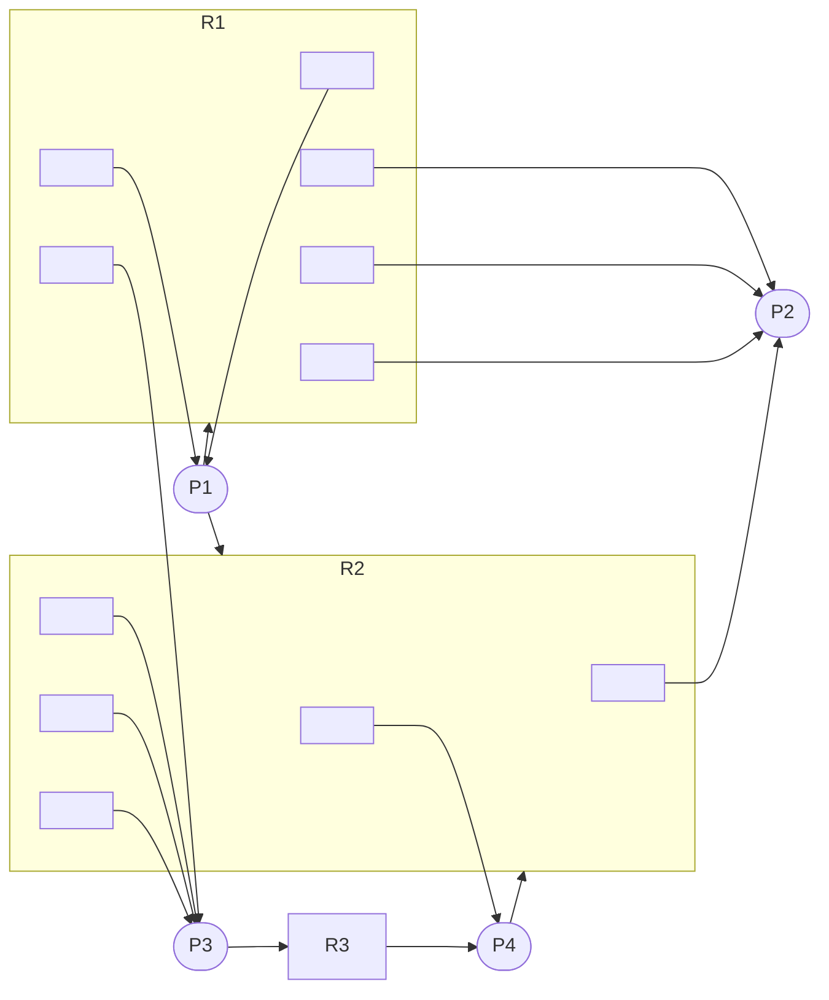
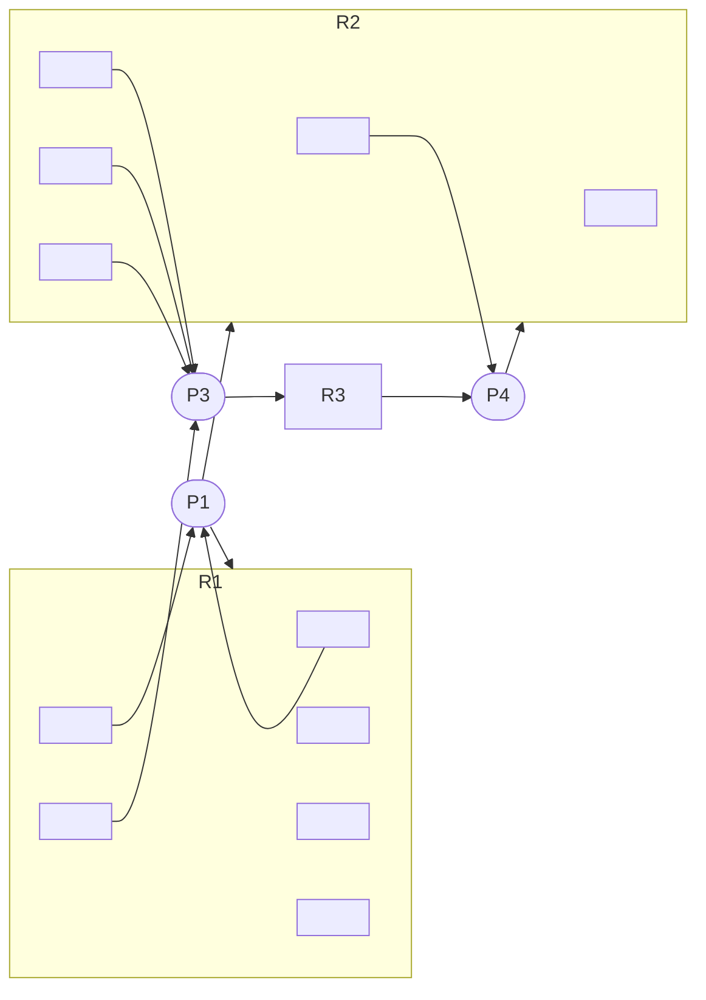
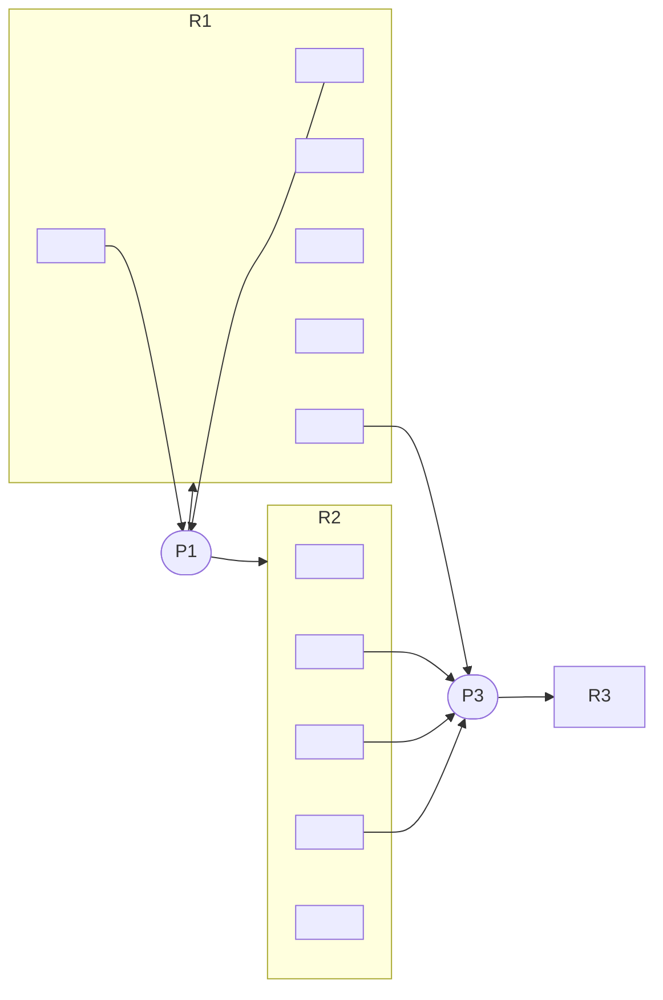
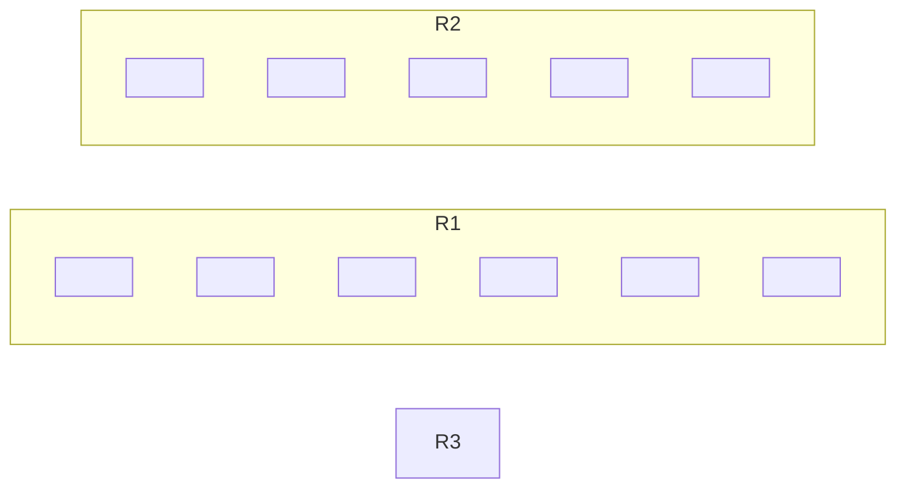

# 作业：第3章

> 2022年9月11日、2022年9月13–14日，2022年10月22日。

## 1 和尚打水

> 某寺庙中有若干个老和尚和小和尚，并有一个水缸能储存10桶水，小和尚每天从寺庙的水井中打水入缸供老和尚饮用。寺庙中有3个水桶，小和尚从井中打水时，由于水井口窄，每次只能使用1个水桶；每次打水入缸和从缸中取水仅为1桶，且不可同时进行。试用信号量和P、V操作，给出小和尚从井中打水和老和尚从缸中取水的算法描述。

- 信号量（及其初值）：

  - 水井使用权（`1`）。

  - 水桶（`3`）。

  - 寺庙水缸：使用权（`1`）、水量（`10`）、空量（`0`）。

    > 题目未规定初始水量、空量，可任意指定。

- 小和尚从井中打水：

  ```rust
  // 如果先拿水桶，万一来了三个小和尚，还满水，就会死锁。
  P(寺庙水缸.空量);
  P(水桶);
    P(水井使用权); 从井中打水; V(水井使用权);
  
    P(寺庙水缸.使用权); 倒水入缸; V(寺庙水缸.使用权);
  V(水桶);
  V(寺庙水缸.水量);
  ```

- 老和尚从缸中取水：

  ```rust
  // 如果先拿水桶，万一来了三个老和尚，还没水，就会死锁。
  P(寺庙水缸.水量);
  P(水桶);
      P(寺庙水缸.使用权); 从缸中取水; V(寺庙水缸.使用权);
  
      饮用;
  V(水桶);
  V(寺庙水缸.空量);
  ```

## 2 猴子攀索

> 一个主修动物行为学、辅修计算机科学的学生参加了一个课题，调查花果山的猴子是否能被教会理解死锁。他找了一处峡谷，横跨峡谷拉了一条南北方向的绳索，这样猴子就可以攀着绳索越过峡谷。只要它们朝着同样的方向，同一时刻可以有多只猴子通过。但是如果在相反的方向上同时有猴子通过，则会发生死锁（这些猴子将被卡在绳索中间，假设这些猴子无法在绳索上从另一只猴子身上翻过去）。如果一只猴子想越过峡谷，它必须看当前是否有其他猴子在逆向通行。请使用信号量机制解决该问题。

- 计数器（及其初值）：

  - 向南：数量（`0`）。
  - 向北：数量（`0`）。

- 信号量（及其初值）：

  - 通行权（`1`）。
  - 向南：计数权（`1`）。
  - 向北：计数权（`1`）。

- 向南：

  ```rust
  P(向南.计数权);
      if 向南.数量 == 0 {
          P(通行权);
      }
      向南.数量 += 1;
  V(向南.计数权);
  
  向南爬;
  
  P(向南.计数权);
      向南.数量 -= 1;
      if 向南.数量 == 0 {
          V(通行权);
      }
  V(向南.计数权);
  ```

- 向北：把“向南”的南北互换即可。

## 3 信箱辩论

> 有A、B两人通过信箱进行辩论，每个人都从自己的信箱中取得对方的问题。将答案和向对方提出的新问题组成一个邮件放入对方的邮箱中。假设A的信箱最多放M个邮件，B的信箱最多放N个邮件。初始时A的信箱中有x个邮件（0<x<M），B的信箱中有y个邮件（0<y<N）。辩论者每取出一个邮件，邮件数减1。A和B两人的操作过程描述如下：
>
> 1. CoBegin
>
> 2. A、B
>
>    - A
>
>      ```
>      while(TRUE) {
>        从A的信箱中取出一个邮件；
>        回答问题并提出一个新问题；
>        将新邮件放入B的信箱；
>      }
>      ```
>
>    - B
>
>      ```
>      while(TRUE) {
>        从B的信箱中取出一个邮件；
>        回答问题并提出一个新问题；
>        将新邮件放入A的信箱；
>      }
>      ```
>
> 3. CoEnd
>
> 当信箱不为空时，辩论者才能从信箱中取邮件，否则等待。当信箱不满时，辩论者才能将新邮件放入信箱，否则等待。请添加必要的信号量和P、V（或wait、signal）操作，以实现上述过程的同步。要求写出完整过程，并说明信号量的含义和初值。

- 信号量（及其初值）：

  涉及两对生产者—消费者，故各需一套信号量。

  - A：使用权（`1`）、空量（`M`）、存量（`0`）。
  - B：使用权（`1`）、空量（`N`）、存量（`0`）。

- A：

  ```rust
  P(A.存量);
  P(A.使用权); 从A的信箱中取出一个邮件; V(A.使用权);
  V(A.空量);
  
  回答问题并提出一个新问题;
  
  P(B.空量);
  P(B.使用权); 将新邮件放入B的信箱; V(B.使用权);
  V(B.存量);
  ```

- B：把“A”的AB互换即可。

## 4 传递消息

> 在消息传递方式下——

### 1 发送进程和接收进程在通信过程中可以采取哪3种同步方式？

- 阻塞发送，阻塞接收。（同步通信）
- 非阻塞发送，阻塞接收。（异步通信）
- 非阻塞发送，非阻塞接收。

### 2 试以下面给出的发送进程和接收进程（将接收到的数据存入S）为例，说明当接收进程执行到标号为L2的语句时，采用这3种同步方式，X的值可能各是多少？

> - 发送进程P
>
>   ```
>   M=10;
>  L1:   send M to Q;
>   L2:   M=20;
>  Goto L1;
>   ```
> 
> - 接收进程Q
> 
>   ```
>   S=-100;
>    L1:   receive S from P;
>   L2:   X=S+1

- **阻塞发送，阻塞接收**

  由于阻塞，以下语句的执行顺序完全确定。

  ```
  (P) M = 10;
  (P) L1: send M to Q;
  (Q) L1: receive S from P;
  (Q) L2: X = S+1;
  ```

  故`X`为`10 + 1 = 11`。

- **非阻塞发送，阻塞接收**

  P 中`M`为`10`或`20`，不一定哪次发送让 Q 收到，所以`S`也可为这些值。

  从而`X`为`11`或`21`。

- **非阻塞发送，非阻塞接收**

  若 Q 成功接收，则情况同“非阻塞发送，阻塞接收”；否则相当于未接收，`X = -100 + 1 = -99`。

  故`X`为`-99`或`11`或`21`。

## 5 从不死锁

> 假定系统有N个进程共享M个同类资源，规定每个进程至少申请一个资源，每个进程的最大需求不超过M，所有进程的需求总和小于M+N。为什么在这种情况下也绝不会发生死锁？试证明。

设第 $i$ 个进程需要 $R_i$ 个资源，实际获得 $r_i$ 个资源，则 $\forall i,\, 0 \leq r_i \leq R_i \leq M$，且 $\sum_i R_i < M + N$，$\sum_i r_i \leq M$，$\sum_i 1 = N$。

假设已经发生了死锁，那么所有进程都需要更多资源才能运行而无资源可分配，即 $\forall i,\, r_i < R_i$ 而 $\sum_i r_i = M$。由于都是整数，前者等价于 $\forall i,\ r_i + 1 \leq R_i$，求和得 $\sum_i r_i + \sum_i 1 \leq \sum_i R_i$。再代入就是 $M+N \leq \sum_i R_i < M+N$，矛盾。

---

注意上述假设实际还要求死锁时所有进程都未运行完，这并不一定成立。若不成立，则问题转化为更小的 $N$，此时仍有 $\forall i,\, 0 \leq r_i \leq R_i \leq M$，$\sum_i r_i \leq M$，$\sum_i 1 = N$。下面论证剩下的 $\sum_i R_i < M + N$ 仍成立。

与原问题相比，不等号左侧减少了已运行完的那些 $R_i$，由 $\forall i,\, R_i \geq 1$，至少减少了 $\abs{\Delta N} \times 1$；不等号右侧 $M$ 不变，$N$ 变小 $\abs{\Delta N}$。因此不等式仍成立。

## 6 银行家算法

> 系统在某一时刻的状态如下表所示。
>
> <table>
>     <thead>
>         <tr>
>             <th rowspan="2">&nbsp;</th>
>             <th colspan="4">Allocation</th>
>             <th colspan="4">Max</th>
>             <th colspan="4">Available</th>
>         </tr>
>         <tr>
>             <th>A</th>
>             <th>B</th>
>             <th>C</th>
>             <th>D</th>
>             <th>A</th>
>             <th>B</th>
>             <th>C</th>
>             <th>D</th>
>             <th>A</th>
>             <th>B</th>
>             <th>C</th>
>             <th>D</th>
>         </tr>
>     </thead>
>     <tbody>
>         <tr>
>             <th>P0</th>
>             <td>0</td>
>             <td>0</td>
>             <td>1</td>
>             <td>2</td>
>             <td>0</td>
>             <td>0</td>
>             <td>1</td>
>             <td>2</td>
>             <td rowspan="5">1</td>
>             <td rowspan="5">5</td>
>             <td rowspan="5">2</td>
>             <td rowspan="5">0</td>
>         </tr>
>         <tr>
>             <th>P1</th>
>             <td>1</td>
>             <td>0</td>
>             <td>0</td>
>             <td>0</td>
>             <td>1</td>
>             <td>7</td>
>             <td>5</td>
>             <td>0</td>
>         </tr>
>         <tr>
>             <th>P2</th>
>             <td>1</td>
>             <td>3</td>
>             <td>5</td>
>             <td>4</td>
>             <td>2</td>
>             <td>3</td>
>             <td>5</td>
>             <td>6</td>
>         </tr>
>         <tr>
>             <th>P3</th>
>             <td>0</td>
>             <td>6</td>
>             <td>3</td>
>             <td>2</td>
>             <td>0</td>
>             <td>6</td>
>             <td>5</td>
>             <td>2</td>
>         </tr>
>         <tr>
>             <th>P4</th>
>             <td>0</td>
>             <td>0</td>
>             <td>1</td>
>             <td>4</td>
>             <td>0</td>
>             <td>6</td>
>             <td>5</td>
>             <td>6</td>
>         </tr>
>     </tbody>
> </table>
>
> 使用银行家算法回答下列问题：
>

### 1 请给出Need矩阵。

$$
\begin{split}
\text{Need} &= \text{Max} - \text{Allocation} \\
&= \begin{bmatrix}
    0 & 0 & 0 & 0 \\
    0 & 7 & 5 & 0 \\
    1 & 0 & 0 & 2 \\
    0 & 0 & 2 & 0 \\
    0 & 6 & 4 & 2 \\
\end{bmatrix}.
\end{split}
$$

### 2 系统是否处于安全状态？

处于。

1. Available 可覆盖 Need 中的 P0，于是 Available 更新为 $(1,5,3,2)$。
2. 可覆盖 P3，更新为 $(1,11,6,4)$。
3. 可覆盖 P2，更新为 $(2,14,11,8)$。
4. 此时其余两进程 P0、P4 加起来的需求都能被 Available 覆盖，按任意顺序执行他们即可。
5. 至此进程全都运行完，故原系统安全。

### 3 如果从进程P1发来一个请求(0,4,2,0)，这个请求能否立刻被满足？

能。

1. Available 能覆盖这个请求。

2. 假如满足，则 Available 变为 $(1,1,0,0)$，
   $$
   \text{Work} = \begin{bmatrix}
       0 & 0 & 0 & 0 \\
       0 & 3 & 3 & 0 \\
       1 & 0 & 0 & 2 \\
       0 & 0 & 2 & 0 \\
       0 & 6 & 4 & 2 \\
   \end{bmatrix}.
   $$

3. Available 可覆盖 Need 中的 P0，于是 Available 更新为 $(1,1,1,2)$。

4. 可覆盖 P3，更新为 $(1,7,4,4)$。

5. 可覆盖 P2，更新为 $(2,10,9,8)$。

6. 可覆盖 P1，之前其 Need 已变为 $(1,4,2,0)$，故此时 Available 更新为 $(3,14,11,8)$。

7. 可覆盖 P4。

8. 至此进程全都运行完，系统仍然安全，故可立即满足之。

## 7 分配资源

> 进程资源的使用情况和可用情况如下表所示。
>
> <table>
>     <thead>
>         <tr>
>             <td rowspan="2"></td>
>             <th colspan="3">Allocation</th>
>             <th colspan="3">Need</th>
>             <th colspan="3">Available</th>
>         </tr>
>         <tr>
>             <th>R1</th>
>             <th>R2</th>
>             <th>R3</th>
>             <th>R1</th>
>             <th>R2</th>
>             <th>R3</th>
>             <th>R1</th>
>             <th>R2</th>
>             <th>R3</th>
>         </tr>
>     </thead>
>     <tbody>
>         <tr>
>             <th>P1</th>
>             <td>2</td>
>             <td>0</td>
>             <td>0</td>
>             <td>1</td>
>             <td>1</td>
>             <td>0</td>
>             <td rowspan="4">0</td>
>             <td rowspan="4">0</td>
>             <td rowspan="4">0</td>
>         </tr>
>         <tr>
>             <th>P2</th>
>             <td>3</td>
>             <td>1</td>
>             <td>0</td>
>             <td>0</td>
>             <td>0</td>
>             <td>0</td>
>         </tr>
>         <tr>
>             <th>P3</th>
>             <td>1</td>
>             <td>3</td>
>             <td>0</td>
>             <td>0</td>
>             <td>0</td>
>             <td>1</td>
>         </tr>
>         <tr>
>             <th>P4</th>
>             <td>0</td>
>             <td>1</td>
>             <td>1</td>
>             <td>0</td>
>             <td>1</td>
>             <td>0</td>
>         </tr>
>     </tbody>
> </table>

### 1 请画出资源分配图。



### 2 该资源分配图是否可以简化？若可以，请给出简化步骤。

P2 所有需求已被满足，可去除其关系。



P4 可获取 R2 剩余的那个资源，随后满足所有需求，删除之。



P3 现在可获得 R3，从而满足所有需求，删除之。P1 同样有剩余资源可供满足，同样删除。



所有进程最终都得到了满足，不再可化简。

### 3 在上表所示情况下系统会发生死锁吗？

不会发生。

化简中已经让所有进程能运行。
