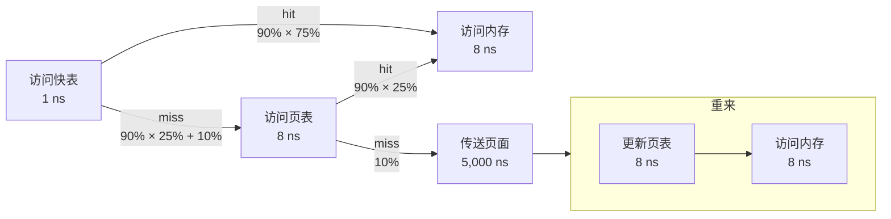

# 作业：第4章

> 2022年9月27日，2022年10月22日。

$$
\newcommand\SI[2]{#1\ \mathrm{#2}}  % siunitx (package)
$$

## 1 名词解释

<dl>
    <dt>逻辑地址</dt>
    <dd>CPU 产生的地址，输入存储管理单元。一般相对于当前进程数据段的开头。</dd>
    <dt>物理地址</dt>
    <dd>存储单元接触的地址，从存储管理单元输出。一般相对于所有可用物理存储的开头。</dd>
    <dt>静态重定位</dt>
    <dd>装入作业时一次性重定位（虚拟逻辑地址→实际物理地址），程序执行前已固定。可由软件完成。</dd>
    <dt>动态重定位</dt>
    <dd>执行程序时（CPU 访问时）重定位，执行前还不固定。必须硬件支持。</dd>
</dl>
## 2 可变式分区

> 考虑有一个可变分区系统，含有如下顺序的空闲区：10K，40K，20K，18K，7K，9K，12K和15K，若有如下的请求序列：12K，10K，9K。请分别给出采用首次适应、最佳适应和最坏适应算法时，空闲区的分配情况。

加下划线表示分配出去了，留空表示同上一行。

- **首次适应**

  |             初始 |    10 K     |               40 K                | 20 K |  …   | 15 K |
  | ---------------: | :---------: | :-------------------------------: | :--: | :--: | :--: |
  | **请求 12 K 后** |             |        <u>12 K</u> \| 28 K        |      |      |      |
  | **请求 10 K 后** | <u>10 K</u> |        <u>12 K</u> \| 28 K        |      |      |      |
  |         **最后** | <u>10 K</u> | <u>12 K</u> \| <u>9 K</u> \| 19 K |      |      |      |

- **最佳适应**

  |     初始 |    10 K     | 40 K | 20 K | 18 K | 7 K  |    9 K     |    12 K     | 15 K |
  | -------: | :---------: | :--: | :--: | :--: | :--: | :--------: | :---------: | :--: |
  | **最后** | <u>10 K</u> |      |      |      |      | <u>9 K</u> | <u>12 K</u> |      |

- **最坏适应**

  |             初始 | 10 K |                40 K                |        20 K        | 18 K |  …   | 15 K |
  | ---------------: | :--: | :--------------------------------: | :----------------: | :--: | :--: | :--: |
  | **请求 12 K 后** |      |        <u>12 K</u> \| 28 K         |                    |      |      |      |
  | **请求 10 K 后** |      | <u>12 K</u> \| <u>10 K</u> \| 18 K |                    |      |      |      |
  |         **最后** |      | <u>12 K</u> \| <u>10 K</u> \| 18 K | <u>9 K</u> \| 11 K |      |      |      |

## 3  碎片和快表

### (1) 什么是碎片？外部碎片和内部碎片的区别是什么？

- **碎片**

  地址分配后的空闲间隙。由于连续长度很小，难以分配给新进程。

- **区别**

  外部碎片在已分配区之外，属于空闲区；而内部碎片在已分配区之内，只是进程并未真正使用这些存储区域。

### (2) 什么是快表？它在地址转换中起什么作用？

- **概念**

  一块存储空间较小，但能并行高速访问的硬件缓存。快表保存了一些键值对，键是逻辑页号，值是相应物理页框号。

- **作用**

  快表保存了常用页的地址映射，命中时可将内存访问次数从两次降低为一次（不用再访问页表），加快访问。

## 4 页式存储

> 某系统采用页式（Paging）存储管理策略，拥有逻辑空间32页，每页2KB；拥有物理空间1MB。

#### (1) 写出逻辑地址的格式。

```
<5位页号><11位页内偏移>
```

$32 = 2^5$，$2 \text{ k} = 2\times 2^{10} = 2^{11}$，所以高 5 位是页号，低 11 位是页内偏移。

#### (2) 若不考虑访问权限位，进程的页表有多少项（Entry）？每项至少多少位（bit）？

共 32 页，故 32 项。

物理空间 $1 \text{ M} = 2^{20}$，故物理地址有 20 位。抛开 11 位页内偏移，物理页框号应有 9 位。因此每项 9 位。

#### (3) 如果物理空间减少一半，页表结构应做怎样的改变？

项数不变，位数减一。

## 5 缺页中断

> 一个进程在执行过程中，按如下顺序依次访问各页：0，1，7，2，3，2，7，1，0，3，2，5，1，7。若进程分得四个主存块，在分别采用FIFO、LRU和OPT算法时，分别产生多少次缺页中断？假设进程开始运行时，主存没有页面。

留空表示同上一行。每一行是请求完成后的主存状况。

### FIFO

| 请求 | 主存块1  | 主存块2  | 主存块1  | 主存块1  |
| :--: | :------: | :------: | :------: | :------: |
|  0   |    0     | （空闲） | （空闲） | （空闲） |
|  1   |          |    1     |          |          |
|  7   |          |          |    7     |          |
|  2   |          |          |          |    2     |
|  3   |    3     |          |          |          |
|  2   |          |          |          | （命中） |
|  7   |          |          | （命中） |          |
|  1   |          | （命中） |          |          |
|  0   |          |    0     |          |          |
|  3   | （命中） |          |          |          |
|  2   |          |          |          | （命中） |
|  5   |          |          |    5     |          |
|  1   |          |          |          |    1     |
|  7   |    7     |          |          |          |

出现 9 次数字，故发生 9 次缺页中断。

### LRU

| 请求 | 主存块1 | 主存块2  | 主存块1  | 主存块1  |
| :--: | :-----: | :------: | :------: | :------: |
|  0   |    0    | （空闲） | （空闲） | （空闲） |
|  1   |         |    1     |          |          |
|  7   |         |          |    7     |          |
|  2   |         |          |          |    2     |
|  3   |    3    |          |          |          |
|  2   |         |          |          | （命中） |
|  7   |         |          | （命中） |          |
|  1   |         | （命中） |          |          |
|  0   |    0    |          |          |          |
|  3   |         |          |          |    3     |
|  2   |         |          |    2     |          |
|  5   |         |    5     |          |          |
|  1   |    1    |          |          |          |
|  7   |         |          |          |    7     |

11 次。

### OPT

| 请求 | 主存块1  | 主存块2  | 主存块1  | 主存块1  |
| :--: | :------: | :------: | :------: | :------: |
|  0   |    0     | （空闲） | （空闲） | （空闲） |
|  1   |          |    1     |          |          |
|  7   |          |          |    7     |          |
|  2   |          |          |          |    2     |
|  3   |    3     |          |          |          |
|  2   |          |          |          | （命中） |
|  7   |          |          | （命中） |          |
|  1   |          | （命中） |          |          |
|  0   |          |          |    0     |          |
|  3   | （命中） |          |          |          |
|  2   |          |          |          | （命中） |
|  5   |          |          |    5     |          |
|  1   |          | （命中） |          |          |
|  7   |    7     |          |          |          |

8 次。

> 结尾5、7缺页时，有多种选择。

## 6 请求分页

> 请求分页管理系统中，假设某进程的页表内容见下表。
>
> | 页号 | 页框（Page Frame）号 | 有效位（存在位） |
> | :--: | :------------------: | :--------------: |
> |  0   |         101H         |        1         |
> |  1   |                      |        0         |
> |  2   |         254H         |        1         |
>
> 页面大小为 4 KB，一次内存的访问时间为 100 ns，一次快表（TLB）的访问时间为 10 ns，处理一次缺页的平均时间为 10^8^ ns（已含更新 TLB 和页表的时间），进程的驻留集大小固定为 2，采用最近最少使用置换算法（LRU）和局部淘汰策略。假设
>
> 1. TLB 初始为空；
> 2. 地址转换时先访问 TLB，若 TLB 未命中，再访问页表（忽略访问页表之后的 TLB 更新时间）；
> 3. 有效位为0表示页面不在内存，产生缺页中断，缺页中断处理后，返回到产生缺页中断的指令处重新执行。
>
> 设有虚地址访问序列2362H、1565H、25A5H，请问：
>
> 1. 依次访问上述三个虚地址，各需多少时间？给出计算过程。
> 2. 基于上述访问序列，虚地址1565H的物理地址是多少。请说明理由。 

页面大小为 4 KB，故页内偏移有 12 位，相当于三位十六进制数。

- **访问时间**

  1. 2362H

     逻辑页号为 2。访问快表未命中（10 ns），访问页表并命中（100 ns），向快表添加 2 号页（忽略），访问内存（100 ns）——共 210 ns。

     此时快表中只有 2 号页，页表不变。

  2. 1565H

     逻辑页号为 1。访问快表未命中（10 ns），访问页表未命中（100 ns），缺页中断（10^8^ ns），访问内存（100 ns）——共 10^8^ ns + 210 ns。

     此时快表、页表中都是 1、2 号页。

     > 重来时无需再访问快表。

  3. 25A5H

     逻辑页号为 2。访问快表并命中（10 ns），访问内存（100 ns）——共 110 ns。

- **1565H的物理地址**

  缺页中断时，因为“驻留集大小固定为 2”，需淘汰一页。按 LRU，0 号比 2 号久远，淘汰 0 号，置换为 1 号，故 1 号页的页框号是 101H。

  因此 1565H 的物理地址是 101 565H。

## 7 请求页式命中

> 一个请求分页管理系统中，内存的读写周期为8ns，当配置有快表时，查找快表需要1ns，内、外存之间传送一个页面的平均时间为5000ns。假定快表的命中率为75%，页面失效率为10%，求内存的有效存取时间。



> 标的百分比是联合概率，不是条件概率。
>
> 缺页率 10% 是总的缺页比例，分母不只包括没命中快表的那些，还包括命中了快表的。
>
> 快表命中率 75% 是有效页面中的命中率，分母不包括缺页的。

有效存取时间由四类操作贡献。

- 访问快表（仅指初次）：1 ns，必然存在。期望为 1 ns。

- 访问页表：8 ns，$(1-10\%) \times (1 - 75\%) + 10\% = 32.5\%$ 可能存在。期望为 2.6 ns。

- 访问内存：8 ns，$1 - 10\% = 90\%$ 可能存在。期望为 7.2 ns。

- 传送页面和重来：$\SI{5,000}{ns} + \SI{8}{ns} + \SI{8}{ns} = \SI{5,016}{ns}$，$10\%$ 可能存在。期望为 501.6 ns。

  > 快表也要更新，但参考答案认为它与页表同时更新，故不再计入时间。

有效存取时间为四类操作期望之和，即 512.4 ns。

---

若允许并行访问快表、页表，则除了命中快表的情况（第一个`hit`，概率为 90% × 75% = 67.5%），“访问快表”都不再计入时间，最终减少时间的期望是 $\SI{1}{ns} \times (1 - 67.5\%) = \SI{0.325}{ns}$，有效存取时间变为 $\SI{512.075}{ns}$。

